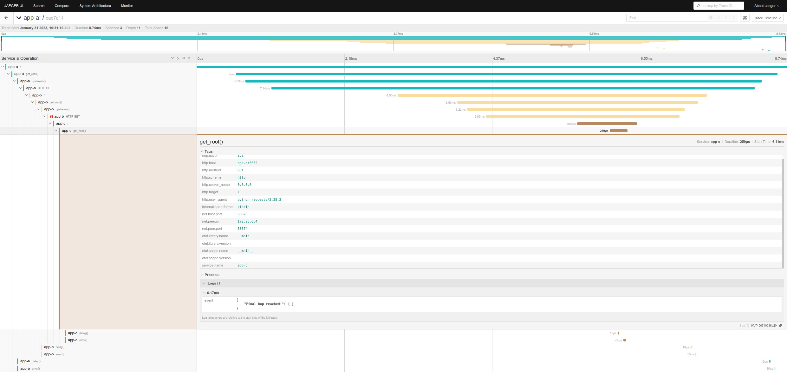
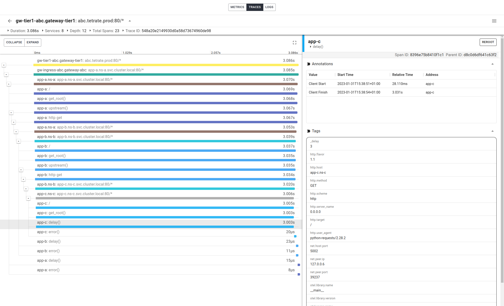
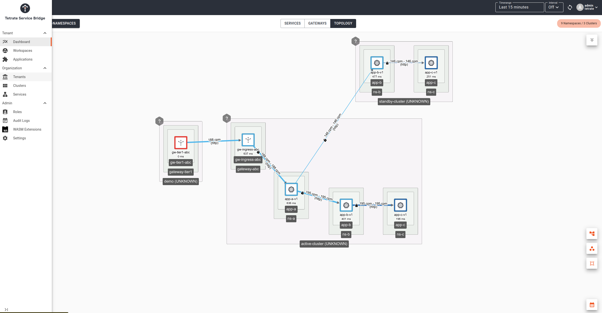

# Distributed Tracing Demo Application in Python3

## Introduction

This Python3 Flask based demo application can be used to test distributed tracing features based on Zipkin and Opentelemetry. It runs as an HTTP server, that allows dynamic configuration through a yaml based config file to achieve the following functionality:
 - configure the name and listening port of the HTTP server
 - configure the next upstream hop (if needed) or terminate and return traffic
 - add each hostname to the payload as it traverses various instances of this server
 - send opentelemetry or zipkin traces to a collector
 - (optional) insert delay, at a certain rate with lower and upped bound value
 - (optional) insert error, at a certain rate with configurable error code
 - (optional) insert extra tracing tags

The demo environment is scripted to run in a local [docker-compose](https://docs.docker.com/compose/install) based environment with a Jaeger instance, but can also easily get deployed into a kubernetes or istio based cluster.

### Prerequisites

In order to use this repository, the following SW needs to be installed on your host.
 - make
 - [docker-compose](https://docs.docker.com/compose/install)
 - kubectl
 - python3 (for dev changes only)

## Local usage

In order to spin up a local `docker-compose` based playground environment, the following `Makefile` target are available:

```console
$ make
help                           This help
build                          Build the container
build-nc                       Build the container without cache
run                            Run docker compose environment
stop                           Stop and remove docker compose environment
test-curl                      Send curl traffic
publish                        Tag and publish container
release                        Make a full release
deploy-app-abc                 Deploy app-abc in kubernetes
undeploy-app-abc               Undeploy app-abc from kubernetes

$ make up
docker-compose up -d
[+] Running 4/4
 ⠿ Container jaeger  Started 0.6s
 ⠿ Container app-a   Started 1.3s
 ⠿ Container app-b   Started 2.1s
 ⠿ Container app-c   Started 3.1s

$ docker ps
CONTAINER ID   IMAGE                                       PORTS                                                                                                                                                                                                                                                                                                                                         NAMES
9aece5a25c24   boeboe/demo-app-abc              0.0.0.0:5002->5002/tcp, :::5002->5002/tcp                                                                                                                                                                                                                                                                         app-c
4a8b73b2e7fc   boeboe/demo-app-abc              0.0.0.0:5001->5001/tcp, :::5001->5001/tcp                                                                                                                                                                                                                                                                          app-b
a9f560b3edf6   boeboe/demo-app-abc              0.0.0.0:5000->5000/tcp, :::5000->5000/tcp                                                                                                                                                                                                                                                                          app-a
d92f96c1ec01   jaegertracing/all-in-one:latest  5775/udp, 5778/tcp, 14250/tcp, 0.0.0.0:9411->9411/tcp, :::9411->9411/tcp, 6832/udp, 14268/tcp, 0.0.0.0:6831->6831/udp, :::6831->6831/udp, 0.0.0.0:16686->16686/tcp, :::16686->16686/tcp   jaeger
```

> After this the Jaeger UI is available on your host machine at http://localhost:16686/search

Now we can send distributed trace friendly traffic to generate traces and spans. The response body will show the hops traversed.

```console
$ make test-curl 
# Generating random requestid, traceid and spanid
requestid=`echo $RANDOM | md5sum | head -c 32` ;
traceid=`echo $RANDOM | md5sum | head -c 32` ;
spanid=`echo $RANDOM | md5sum | head -c 16` ;

# Generated traffic command using those random ids
curl http://127.0.0.1:5000/ -H "x-b3-sampled: 1" -H "x-request-id: $requestid" -H "x-b3-traceid: $traceid" -H "x-b3-spanid: $spanid" ;
```

The above `Makefile` target will print out shell code to generate valid and random `requestid`, `traceid` and `spanid`. The `curl` command to use them properly is also printed, so you can generate test traffic easily.

The following screenshots shows a resulting traffic span of such traffic for Jaeger and the [Tetrate Service Bridge](https://docs.tetrate.io/service-bridge) GUI.





Note that TSB supports telemetry in an active/standby multi-cluster scenario, including in depth sidecar and application trace spans.




### Configuration

By default the `docker-compose` setup will use the yaml based config files as defined [here](./config).

Let us take a look at one of those example, for app-a [here](./config/config-app-a.yaml):

```yaml
server:
  name: app-a
  port: 5000
  debug: true
traffic:
  upstream_host: http://app-b:5001
  delay:
    enabled: true
    rate: 10
    from: 1
    to: 3
  error:
    enabled: true
    rate: 10
    code: 404
tracing:
  endpoint: http://jaeger:9411/api/v2/spans
  tags:
    message: "Hello from app-a"
    quote: "There's no place like home."
```

The following table gives an overview of the configurable parameters:

| parameter | type | mandatory | explanation |
|-----------|------|-----------|-------------|
| server.name | string | yes | name of the server used in tracing |
| server.port | int | yes | HTTP listener port ||
| server.debug | bool | no | enable debug logs (default False) |
| traffic.upstream_host | string | no | URL for next hop (default empty) |
| traffic.delay.enabled | bool | no | enable delay injection |
| traffic.delay.rate | int | no | rate (0-100) of delayed responses |
| traffic.delay.from | int | no | lower bound of delays in seconds |
| traffic.delay.to | int | no | upper bound of delays in seconds |
| traffic.error.enabled | bool | no | enable error injection |
| traffic.error.rate | int | no | rate (0-100) of error responses |
| traffic.error.code | int | no | error code to inject (eg 404) |
| tracing.endpoint | string | yes | trace collector (eg jaeger) endpoint |
| tracing.tags | map(string,string) | no | a map of optional tags to add in the tracing |


## Kubernetes usage

In order to deploy, have a look at the yaml files in the [kubernetes](./kubernetes) folder for an example. The config file is available in a POD mounted K8s ConfigMap.

We have also provided a `Makefile` target to deploy those.

```console
$ make deploy-app-abc 
kubectl apply -f kubernetes/
namespace/ns-a unchanged
namespace/ns-b unchanged
namespace/ns-c unchanged
service/app-a configured
serviceaccount/sa-app-a unchanged
configmap/app-a-config created
deployment.apps/app-a-v1 configured
service/app-b configured
serviceaccount/sa-app-b unchanged
configmap/app-b-config created
deployment.apps/app-b-v1 configured
service/app-c configured
serviceaccount/sa-app-c unchanged
configmap/app-c-config created
deployment.apps/app-c-v1 configured
```

In case you plan to deploy in an Istio based cluster, read up on the [following documentation](https://istio.io/latest/about/faq/distributed-tracing) w.r.t distributed trace header propagation. The trace header propagation is taken care of in the Python3 server code.

## Build container

In order to make changes to the Python3 code, you can use `virtualenv` to run the Python3 code.

```console
$ python3 -m pip install virtualenv
$ python3 -m venv .venv
$ source .venv/bin/activate
$ python3 -m pip install -r requirements.txt
$ python3 server.py --configfile config/config-app-c.yaml 
```

In order to build a new docker image after changing some server logic, run the `build` target.

```console
$ make build
docker build --build-arg BUILD_DATE="2023-01-31T13:26:59Z" --build-arg BUILD_VERSION="0.3.0" --build-arg DOCKER_ACCOUNT="boeboe" --build-arg IMAGE_DESCRIPTION="Python demo app-abc" --build-arg IMAGE_NAME="demo-app-abc" --build-arg APP_VERSION="0.3.0" --build-arg REPO_URL="https://github.com/boeboe/python-demo-app-abc" --build-arg URL="https://github.com/boeboe/python-demo-app-abc" --build-arg REPO_URL="https://github.com/boeboe/python-demo-app-abc" -t boeboe/demo-app-abc .
[+] Building 57.1s (10/10) FINISHED                                                                                                                                                                                                                                               
 => [internal] load build definition from Dockerfile
 => => transferring dockerfile: 32B
 => [internal] load .dockerignore
 => => transferring context: 34B
 => [internal] load metadata for docker.io/library/ubuntu:focal
 => [1/5] FROM docker.io/library/ubuntu:focal
 => [internal] load build context
 => => transferring context: 100B
 => CACHED [2/5] ADD server.py /usr/local/bin
 => CACHED [3/5] ADD entrypoint.sh /usr/local/bin
 => CACHED [4/5] ADD requirements.txt /
 => [5/5] RUN apt update -y     && apt install -y python3 python3-pip     && pip3 install -r /requirements.txt     && rm -rf /var/lib/apt/lists/*     && rm /requirements.txt     && mkdir -p /etc/app-abc
 => exporting to image
 => => exporting layers
 => => writing image sha256:374c4ff69fe0b5c1e3d4b0e4fe08fc1e672cd0f860481a56b128e35f10d0e7dd
 => => naming to docker.io/boeboe/demo-app-abc
```

In order to release and push the containers, modify the [Makefile](./Makefile) to match your needs (docker user, release version, etc).

```console
$ make release
docker tag boeboe/demo-app-abc boeboe/demo-app-abc:0.3.0
docker push boeboe/demo-app-abc:0.3.0
The push refers to repository [docker.io/boeboe/demo-app-abc]
02fd403a88c4: Pushed
e1290ee69156: Layer already exists
ce626b6cee91: Layer already exists
63c5051e39c9: Layer already exists
36ffdceb4c77: Layer already exists
0.3.0: digest: sha256:15b9c192b5cd1ee8cfd3f514870308d95076ae2a6e8bf3f45967cb4b80b1bc87 size: 1364
Check released tags on https://hub.docker.com/r/boeboe/demo-app-abc/tags
```